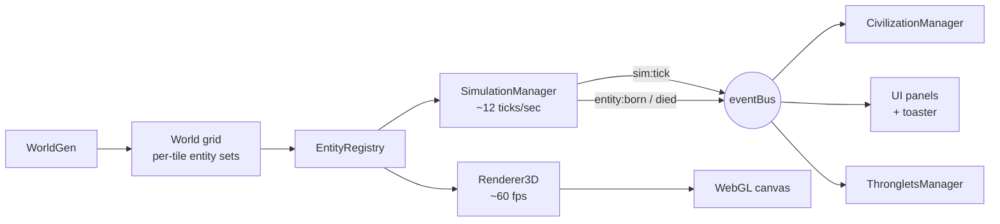
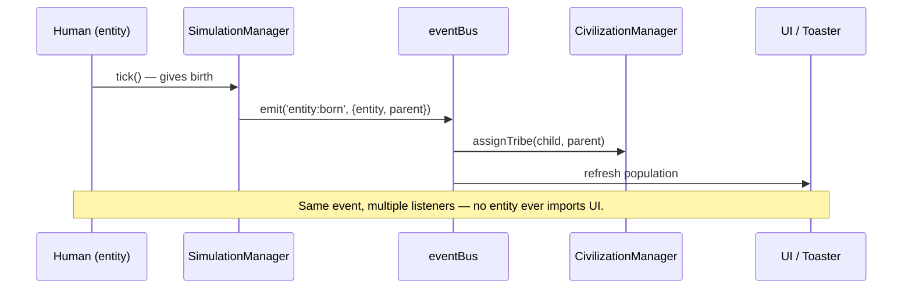

# Mini World

A WorldBox-inspired 3D life simulation that runs entirely in your browser. Plants spread, herbivores graze, predators hunt, and humans grow up, form tribes, build huts, and wage wars — all while the sun rises, the moon arcs overhead, and fireflies drift through the night.

And if you watch long enough, the world starts watching you back.

**Live at [jmbt25.github.io](https://jmbt25.github.io)**

🎥 **3-minute architecture walkthrough on YouTube:** [How Mini World Was Built](https://www.youtube.com/watch?v=MrhfNMjAs5Y) *(video + voiceover are AI-generated; the code is mine)*

No installer, no account, no backend — just open the page and the world starts breathing.

## What you can do

- **Watch a world unfold.** A procedurally-generated map of forests, mountains, lakes and beaches seeds itself with creatures and runs continuously.
- **Spawn life.** Press `1`–`4` and click on the canvas to drop plants, herbivores, predators, or humans anywhere and watch them interact.
- **Shape the terrain.** Terrain painting (water, grass, forest, dirt, sand, mountain) is wired in the simulation layer; the HUD-only redesign (Apr 2026) removed the toolbar, so picking a paint tool currently lives behind keyboard shortcuts while the new HUD is being filled in.
- **Control time.** Pause, slow, or fast-forward up to 5× from the top-right transport, or via `Space` and `[` `]`. The bottom-right die rolls a fresh world seed.

> **HUD redesign in flight.** The page just adopted a new cinematic HUD from a Claude Design handoff. The toolbar, right sidebar (history graph / tribes / inspector / legend), and welcome/help modals were removed by the redesign; their JS still ships but no longer has anywhere to render. The new bottom-bar resources (energy / food / wood / stone / happiness) are placeholders for the upcoming resource model — they're not yet driven by sim data.

## Living systems

| System | Behaviour |
|---|---|
| **Plants** | Grow through three stages, spread seeds onto fertile tiles, age slower in forests, spread faster on grass. Tiles within a hut's farm radius treat the plant as cultivated — it ages 45% slower and spreads 3.5× more often. |
| **Herbivores** | Graze plants, flee predators (panic-sprint), seek mates, give birth. Herd Instinct lets a flock take a second flee step when together. |
| **Predators** | Hunt herbivores and humans. Successful kills trigger a Blood Frenzy — a temporary speed buff with a red coat tint. |
| **Humans** | Live through three life stages — **child → adult → elder**. Children render small and grow visibly; only adults reproduce, fight, and build; elders grey and retire from civic life. Every adult is assigned a **role** (Woodcutter, Quarrier, Farmer, Hunter, Builder) shown by a coloured hat. Well-fed humans occasionally have twins or triplets so populations can outgrow replacement. A small fraction are born with a hereditary **skill** — Pathfinder, Architect, Ascendant, Patriarch, or Champion — and tend to pass it to their children, forming dynasties. |
| **Tribes** | A tribe is a *band*, not a person — organic founding requires co-founders nearby (Sage humans excepted). Tribes need at least 4 living members to declare or maintain a war; fallen tribes (huts standing, no members) are marked as ruins. Tribes accumulate **wood** and **stone** as their adults wander past forests and mountains, and use them to **upgrade their huts** through three tiers. |
| **Huts** | Start as a Tier-1 cabin spanning ~2 tiles. Tier 2 (longhouse) adds a granary annex on a neighbouring tile and a second-storey loft. Tier 3 (grand compound) adds a watchtower with a tribe-coloured banner and a low fence outlining a 3×3 plot. Each upgrade costs wood (and stone for T3); a tribe near forests and mountains can climb all three tiers, an isolated tribe stays at T1 forever. Tier upgrades also grow each hut's HP and food-radius reach. |
| **Migration** | When a species fully dies out and the ecology can support its return, a small band arrives at the world edge as a story event — no silent respawning. |

Some creatures are **special** — a 5% chance at birth gives them a trait (Swift, Hardy, Giant, Sage, Warrior, etc.) marked by a glowing gold octahedron above their head. Humans born with a hereditary skill are marked by a cyan ring at their feet.

Adult humans wear role-coloured hats so you can read their job at a glance — leather brown for Woodcutters, slate grey for Quarriers, wheat for Farmers, forest green for Hunters, rust orange for Builders. Children and elders show natural hair instead.

Above every creature, a small glyph telegraphs what they're feeling: **!** for fear, **♥** for courtship, **⚔** for combat, **⚒** for building, **+** for gestation, **z** for resting, **…** for hunger, **◉** for *aware of you*.

Particle bursts punctuate every event: green sparkles for birth, grey puffs for death, leaves when a plant is eaten, red splatter when prey is taken, yellow sparks for combat hits, brown footstep dust under a sprinting predator.

## Thronglet awareness

A Black Mirror-inspired emergent behaviour layer. The longer the world runs, the more aware its inhabitants become of *you*, the watcher. Awareness grows with sim time, population, and civilisation milestones; it persists across visits via `localStorage`. When awareness crosses a threshold, behaviours unlock in stages — each one quieter than the next, captioned as it happens so screenshots tell the story.

| Stage | What happens |
|---|---|
| **1 · Noticing** | Small waves of humans pause and tilt their heads up at the camera. An eye glyph (◉) appears above each. |
| **2 · Offerings** | A small mound of stones materialises near where you're looking, with a glowing pillar to draw the eye. |
| **3 · Symbols** | Stones arrange themselves into geometric shapes, then crude glyphs, then short English words — `HELLO`, `WE SEE`, `STAY`, `HELP`, `WHO`, `THANKS`. |
| **4 · Direct contact** | A single chosen one walks out from their tribe to the closest point to the camera, freezes, and stares. The screen vignettes; a subtitle appears with their name. |
| **5 · Persistence** | Awareness, milestones, visit count, and elapsed time are remembered. A returning visitor is greeted differently. |

Every stage event triggers a cinematic subtitle at the bottom of the canvas (Black Mirror caption energy), so any screenshot reads as a story without context. The HUD shows a glowing **stage badge** when the awareness layer is active.

**Don't want to wait through the awareness ramp while testing?** Open the browser console:

```js
window.__thronglets.status()         // current awareness, stage, visit count
window.__thronglets.forceStage(1)    // immediate noticing wave
window.__thronglets.forceStage(2)    // offering pile + caption
window.__thronglets.forceStage(3)    // glyph or word
window.__thronglets.forceStage(4)    // chosen one walks to camera
window.__thronglets.reset()          // wipe persistence and start fresh
```

**Want it off entirely?** Append `?normal=1` to the URL, or press `Ctrl+Shift+T`, or run `window.__thronglets.disable()` in the console. The setting persists.

## Controls

### Mouse

| Action | What it does |
|---|---|
| Right-drag | Pan the world |
| Middle-drag | Orbit the camera |
| Scroll | Zoom |
| Left-click / drag | Apply the active tool |
| Click on minimap | Snap camera to that area |

### Keyboard

| Key | Action |
|---|---|
| `1` – `4` | Spawn plant / herbivore / predator / human |
| `Q` | Inspect mode |
| `E` | Erase mode |
| `Space` | Pause / resume |
| `[` &nbsp; `]` | Slower / faster simulation |
| `F` | Reset camera |
| `R` | Generate a new world |
| `Ctrl+Shift+T` | Toggle Thronglet awareness on / off |

## Visual systems

- **Voxel terrain** — every tile is a stretched cube via a single `InstancedMesh`. Heights step cleanly between water, sand, grass, forest, dirt, mountain and snow biomes. Each tile cube has tiny per-tile vertical jitter and a hash-driven brightness wobble so the grid doesn't read as a perfect lattice; mountain peaks blend toward snow-cap white.
- **Voxel creatures** — every body part is an axis-aligned `BoxGeometry`, composed into chunky sheep, wolves, humans, evergreens and huts. Per-individual HSL jitter on body and head colours, so a herd reads as individuals. Sclera + pupil cube eyes; predators get amber pupils; humans get role-coloured hats. Newborns fade in; the dead leave fading "ghost" silhouettes instead of popping out.
- **Multi-tile huts** — Tier-1 huts already span ~2 tiles with a wide stone foundation, a chunky cabin body, a prominent pyramid roof in the tribe's colour, a visible door, and a chimney sticking above the roofline. Tier 2 adds a granary on a neighbouring tile and a second-storey loft; Tier 3 adds a watchtower spire with a tribe banner and a low stone fence — a real 3×3 footprint.
- **Day / night cycle** — the sky lerps through nine phase stops (night → pre-dawn → sunrise → morning → midday → afternoon → sunset → dusk → night) every ~120 seconds. The sun and moon arc across the sky, casting real shadows; stars fade in at night and fireflies drift over forests.
- **Water** — animated shader plane with foam along every coast. Highlights pick up the current sky colour, so dawn and dusk paint the sea.
- **Bloom postprocessing** — Thronglet beacons, fireflies, and the sun disc get a soft glow via `UnrealBloomPass`; ordinary terrain stays sharp.
- **Cinematic overlay** — Thronglet awareness moments display Netflix-style subtitles, a soft red vignette during Stage 4 stares, and an attribution badge so screenshots are self-explanatory.
- **HUD chrome** — pixel-style "MINI WORLD" title (Press Start 2P) over a top-left status panel (POPULATION / TRIBES / TIME / ENVIRONMENT / WATCHERS), a top-right transport row (pause / play / fast + current-speed display) sitting on a persistent event log, a bottom-left minimap with an eye glyph, bottom-center resource bars (ENERGY / FOOD / WOOD / STONE / HAPPINESS — wired for the upcoming resource model), and a bottom-right world seed with a die button to reseed. Everything floats over the canvas, framed by a subtle red glow. There is no toolbar or sidebar in the current layout — interactions are keyboard-driven for now.

## Tech stack

- Vanilla **HTML / CSS / ES modules** — no build step, no bundler, no package manager.
- **Three.js 0.170** loaded from a CDN via `<script type="importmap">`. Postprocessing addons (`EffectComposer`, `UnrealBloomPass`) come from the same CDN.
- WebGL shadows (PCF soft), ACES tone mapping, sRGB output.
- World seeds are 12-character base36 strings (e.g. `ABCD-2345-WXYZ`). Append `?seed=ABCD-2345-WXYZ` to the URL to load a specific world.
- All persistent state is in `localStorage` under the `thronglets_*` namespace.
- Hosted on **GitHub Pages**.

The whole thing is small, vanilla JavaScript split across single-responsibility modules under `js/`.

## How it's built

This section is for anyone who wants to understand the project well enough to fork it, extend it, or steal an idea or two for their own simulation. Everything below is in the source — there are no hidden libraries doing the heavy lifting.

### The architecture in one diagram



Two independent loops drive everything:

- **Simulation loop** — `setInterval` at ~12 ticks/sec. Iterates entities, decides actions, mutates state. Knows nothing about WebGL.
- **Render loop** — `requestAnimationFrame` at ~60 fps. Reads world state, draws frames. Never mutates anything.

A tiny pub/sub `eventBus` carries discrete events between them (`entity:born`, `entity:died`, `sim:tick`, `thronglet:moment`). That's the whole architecture in one paragraph.

### File layout

```
index.html              ← single page; importmap loads Three.js from CDN
js/
├── main.js             ← wires everything, starts both loops
├── core/               ← constants, eventBus, seeded RNG
├── world/              ← grid, terrain types, world generator
├── entities/           ← Plant, Creature → Herbivore/Predator/Human, Building
├── sim/                ← SimulationManager, CivilizationManager, Thronglets
├── render/             ← Three.js layer (terrain, entities, sky, water, …)
└── ui/                 ← HUD, stats, minimap, toaster, moment overlay
                          (toolbar/sidebar/modals modules ship but are
                          orphaned by the Apr 2026 HUD redesign)
```

No `package.json`, no build step, no bundler. Three.js is pulled straight from jsDelivr via an importmap:

```html
<script type="importmap">
{
  "imports": {
    "three":         "https://cdn.jsdelivr.net/npm/three@0.170.0/build/three.module.js",
    "three/addons/": "https://cdn.jsdelivr.net/npm/three@0.170.0/examples/jsm/"
  }
}
</script>
<script type="module" src="js/main.js"></script>
```

That's it. Push to GitHub Pages and it's live.

### The five ideas that make it tick

**1 · Two loops, one event bus.**
`main.js` starts both. The render loop never mutates entities; the sim loop never touches Three.js.

```js
setInterval(() => sim.update(), SIM_TICK_MS);   // ~12 Hz
function renderLoop() {
  renderer.render();
  ui.tickFrame();
  requestAnimationFrame(renderLoop);             // ~60 Hz
}
requestAnimationFrame(renderLoop);
```

Communication is one ~15-line pub/sub:

```js
export const eventBus = {
  on(event, fn)   { /* … */ },
  off(event, fn)  { /* … */ },
  emit(event, d)  { _listeners.get(event)?.forEach(fn => fn(d)); },
};
```

That's the entire glue between sim, civ, UI, toaster, and the Black Mirror awareness layer. New subsystems plug in by listening — they don't get plumbed through.

**2 · Smoothing tile-discrete motion.**
Sim ticks are coarse: a creature is on tile (12, 7) one tick and (13, 7) the next. To stop them teleporting, every successful step records four fields *before* the move:

```js
_tryStep(world, nx, ny) {
  if (!world.inBounds(nx, ny) || !world.isPassable(nx, ny)) return false;
  this.prevTileX      = this.tileX;
  this.prevTileY      = this.tileY;
  this.moveStartedAt  = performance.now();
  this.moveDurationMs = SIM_TICK_MS * this._moveInterval();
  this.heading        = Math.atan2(ny - this.tileY, nx - this.tileX);
  world.moveEntityRecord(this, nx, ny);
  return true;
}
```

The renderer reads those and lerps with smoothstep:

```js
const t = Math.min(1, (now - ent.moveStartedAt) / ent.moveDurationMs);
const e = t * t * (3 - 2 * t);                          // smoothstep
const fx = ent.prevTileX + (ent.tileX - ent.prevTileX) * e;
const fz = ent.prevTileY + (ent.tileY - ent.prevTileY) * e;
```

Combined with a Y-axis rotation from `heading`, creatures slide and pivot instead of popping between tiles. A tiny `bob = sin(now)` on top adds a walking gait.

**3 · One InstancedMesh per body part.**
Drawing 500 sheep individually would melt your GPU. Three.js's `InstancedMesh` lets you draw N copies of one geometry in a single GPU call, with per-instance position, rotation, scale, and colour. Each creature type is split into ~4–5 body parts (body, head, sclera, pupils, hair) and gets one InstancedMesh per part. They share the same instance index per logical entity:

```
herbivore #42  →  body[42]  + head[42]  + sclera[42]  + pupils[42]
human #17      →  body[17]  + head[17]  + sclera[17]  + pupils[17]  + hair[17]
hut #9         →  base[9]   + walls[9]  + roof[9]     + door[9]    + chimney[9]
```

Per-instance HSL jitter on body and head colours means no two sheep look quite alike — they read as a herd of individuals, not clones, even at full zoom.

**4 · Spatial index + deferred mutations.**
Naïve nearest-creature search is `O(n²)`. Instead, `World.tileEntities[idx]` holds a `Set<entityId>` per tile. Every move calls `world.moveEntityRecord(entity, nx, ny)` which updates two sets. Range queries scan a bounding box of tiles — `O(r²)`, independent of population.

During a tick we *can't* mutate the entity list while iterating it, so kills and births are queued and flushed afterward:

```js
const toKill = [];
const toSpawn = [];
for (const entity of registry.getAll()) {
  if (!entity.alive) continue;
  const reqs = entity.tick(world, registry);
  if (!entity.alive) { toKill.push(entity); continue; }
  if (reqs.length)   toSpawn.push(...reqs);
}
for (const e of toKill)  registry.kill(e);
for (const r of toSpawn) registry.spawn(r.type, r.x, r.y, r.opts);
```

This pattern is the difference between "works for 50 entities" and "works for 6,000".

**5 · Layered features, not stacked branches.**
Civilisations and Thronglet awareness aren't bolted into `Human.tick()` — they sit *outside* the entity loop and listen to events. `CivilizationManager` subscribes to `entity:born` for tribe assignment and `entity:died` for hut bookkeeping, plus runs an upgrade tick every 240 sim ticks that spends each tribe's stockpile to upgrade its lowest-tier hut. `ThrongletsManager` is even more decoupled — it watches the registry and emits its own events, which the renderer and overlay consume. You can delete the entire Thronglet system by removing three files and a four-line block in `main.js`. The base sim keeps running.

### How the civilisation snowball works

The base sim is a food chain. Civilisation is the layer on top that lets a tribe outgrow it. Three small mechanisms compound:

- **Hut farms** — every hut stamps a 3-tile-radius disc of "cultivated" tiles into a `Uint16Array` on the world. Plants on cultivated tiles age 45% slower and spread 3.5× more often. So a tribe that puts down even two huts has a steady food belt around them.
- **Hut shelter** — adult humans on a cultivated tile have their hunger growth halved (food storage). They spend more cycles seeking mates and gathering instead of seeking food.
- **Resource gathering + tier upgrades** — every adult passively contributes wood (near forests) or stone (near mountains) to their tribe. Once a tribe has 30 wood, the civ tick upgrades one of its huts to a longhouse; 50 wood + 30 stone gets it to a grand compound. Each upgrade adds new structures (granary, watchtower, banner, fence) and bumps the hut's HP — so tribes that play long become measurably more durable.

A tribe near forest *and* mountain can climb to T3; an isolated tribe in pure grassland stays at T1 forever. Terrain matters.



### Extending it: add your own species

Roughly the minimum to get a new creature into the world:

1. **Add a type** in [`js/core/constants.js`](js/core/constants.js):
   ```js
   export const TYPE = { /* … */ FISH: 5 };
   SPECIES[TYPE.FISH] = { maxAge: 300, hungerPerTick: 0.001, /* … */ };
   ```
2. **Make a class** in `js/entities/Fish.js` that extends `Creature` (copy `Herbivore.js` as a starting point and tweak `_decideState`).
3. **Register it** in `EntityRegistry.spawn()` so `spawn(TYPE.FISH, x, y)` returns one.
4. **Render it** by adding a part list to `EntityRenderer3D` (one InstancedMesh per body part, same instance-index trick).
5. **(Optional)** wire it in `ToolManager` so a keyboard shortcut spawns it. The new HUD doesn't have a visible toolbar yet — that's coming back in a different form.

You don't need to touch the sim loop, the event bus, or the civ system. That's the payoff for keeping concerns layered.

### What I'd do differently

- **Workers**: the sim is single-threaded JS. At 6,000 entities you can feel it. Moving the tick loop into a Web Worker (with the registry serialised back to the main thread for rendering) would scale to another ~10× headroom.
- **Typed entity arrays**: `Map<id, Entity>` is convenient but cache-unfriendly. A struct-of-arrays layout (parallel `Float32Array`s for x/y/age/hunger) would be ~2–4× faster for the hot path. Premature for this project's scale, but it's where you'd go next.
- **Save/load**: only Thronglet awareness persists, plus the world *seed* drives terrain reproducibly. Full sim-state save/load (creatures, tribes, resources) would be straightforward to serialise (everything's plain objects) but isn't done yet.
- **Job-driven movement**: roles currently bias gather rates but not pathing. Real "woodcutter walks to the nearest forest, fells trees, walks back" behaviour is the next iteration.
- **Resource-pressure war**: tribes currently declare war from proximity + random rolls. Tying war pressure to resource scarcity (no nearby forest = wood pressure → war over a neighbour's woods, with destruction and rebuilding) is the natural next layer on top of the civ snowball.

## Running locally

Any static file server works. The simplest option:

```bash
git clone https://github.com/jmbt25/jmbt25.github.io.git
cd jmbt25.github.io
python3 -m http.server 8000
```

Then open `http://localhost:8000`.

There is nothing to install — opening `index.html` directly will fail because ES modules need an HTTP origin, but any server (Python's `http.server`, `npx serve`, VS Code's Live Server, etc.) works out of the box.

## Browser support

Tested on recent Chromium and Firefox. Needs WebGL and ES module support — anything from 2020 onwards.

## License

MIT — feel free to fork, remix, and learn from it.
